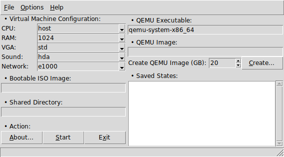

----

**tqemu** is a simple **QEMU** frontend written in core [Tcl/Tk](https://www.tcl.tk).

----

### Features

* User defined [QEMU](https://www.qemu.org) executable
* User defined guest CPU emulation
* User defined guest RAM
* User defined graphics card emulation
* User defined sound card emulation
* User defined network device emulation
* Load and create image (qcow2 format)
* User defined image size
* User defined extra options
* Load multiple images (rearrange with drag n' drop)
* Load states from qcow2 images
* Boot from iso file or from host cd-rom device
* Shared directory between host and virtual machine
* User defined output display (sdl, gtk, vnc, etc)
* Toggle KVM, HAX, HVF support
* Supports many audio channels (PA, OSS, DSound, etc)
* RTC clock configuration
* Daemonize QEMU process
* Start paused
* Show/copy QEMU final execute command
* Command line support
* Does not require libvirt and friends
* Runs in GNU/Linux, Microsoft Windows and Unix (MacOS not tested)

----

### Screenshot

----

### Dependencies

**Tcl** version 8.6 or later.

**Tk** version 8.6 or later.

##### For Microsoft Windows users:

[ActiveTcl](https://www.activestate.com/activetcl) version 8.6 or later.

Executable can be found in the [Releases](https://github.com/thanoulis/tqemu/releases) section.

To run it, after download, right-click->Properties->Unblock.

----

### License

**tqemu** is licensed under the **MIT License**.

Read [LICENSE](LICENSE) for details.

----
