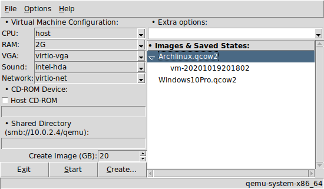

# tQEMU
**tQEMU** is a simple **QEMU** frontend written in core [Tcl/Tk](https://www.tcl.tk).

##### Features:
* user defined [QEMU](https://www.qemu.org) executable
* user defined guest CPU emulation
* user defined guest RAM
* user defined graphics card emulation
* user defined sound card emulation
* user defined network device emulation
* load and create image (qcow2 format)
* user defined image size
* load states from qcow2 images
* boot from iso file
* shared directory between host and virtual machine
* user defined output display (sdl, gtk, etc)
* Toggle KVM support on/off
* Daemonize QEMU process
* Show/copy QEMU final execute command
* Command line support
* Runs in GNU/Linux, MS-Windows and Unix (MacOS not tested)

### Screenshot

## DEPENDENCIES
**Tcl** version 8.5 or later.

**Tk** version 8.5 or later.

##### For MS-Windows users:
[ActiveTcl](https://www.activestate.com/activetcl) version 8.5 or later.

## LICENSE
**tQEMU** is licensed under the **MIT License**.

Read LICENSE for details.
